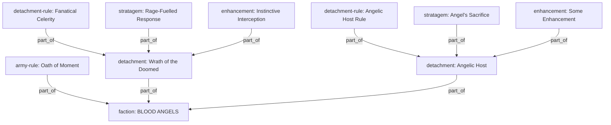
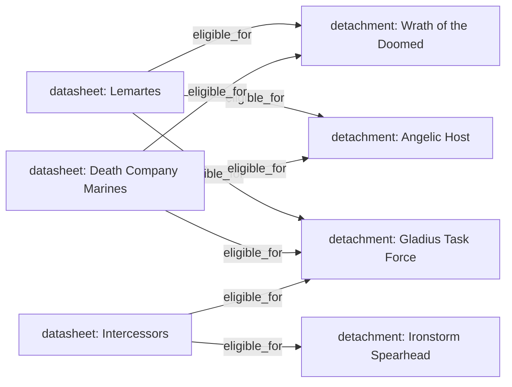
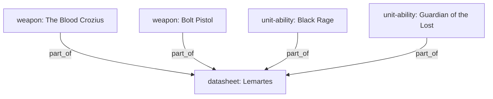
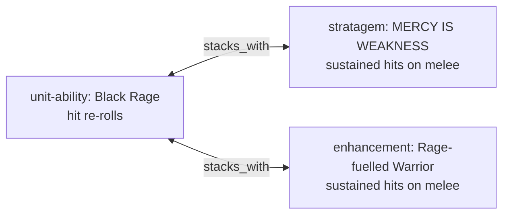
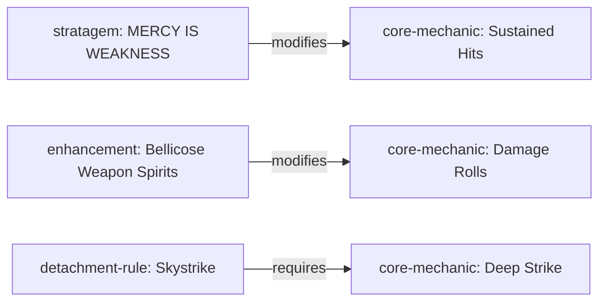
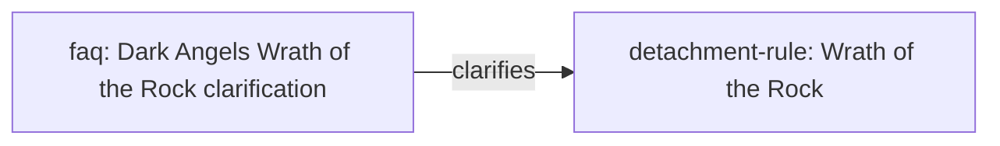
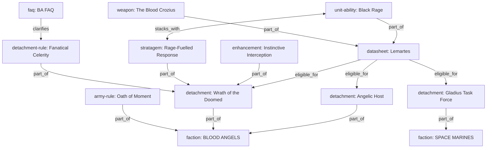
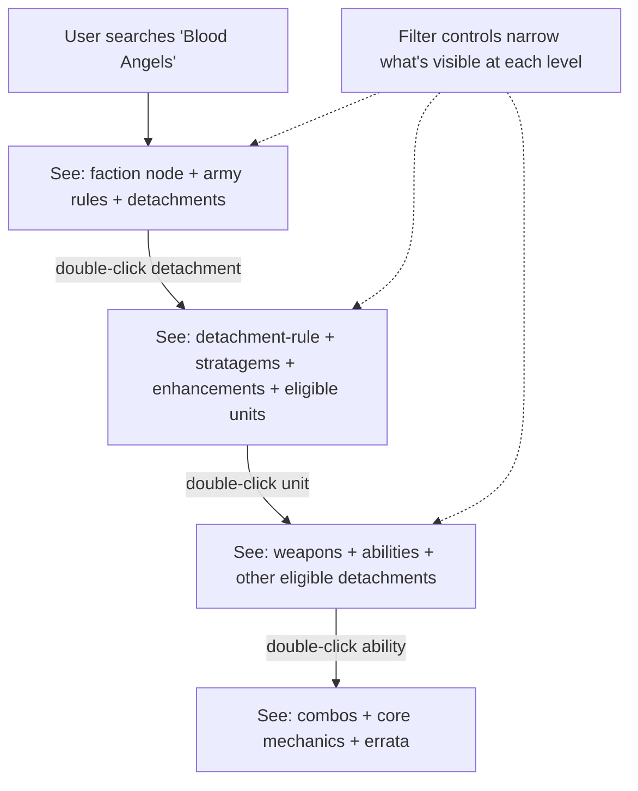

# Brain Data Model

> How nodes connect in the 40K knowledge graph. Every relationship documented.

---

## Node Categories

| Category | What it is | Example |
|---|---|---|
| `faction` | A playable army — auto-generated root node | BLOOD ANGELS, ORKS |
| `army-rule` | Army-wide rule that applies regardless of detachment | Oath of Moment, Blessings of Khorne |
| `detachment` | A detachment container — holds rules, stratagems, enhancements | Wrath of the Doomed, Gladius Task Force |
| `detachment-rule` | The passive ability a detachment grants | Fanatical Celerity, Combat Doctrines |
| `stratagem` | A stratagem inside a detachment | Rage-Fuelled Response (1CP) |
| `enhancement` | An enhancement inside a detachment | Instinctive Interception |
| `faction-ability` | A detachment-scoped ability (not army-wide) | Relentless Rage |
| `datasheet` | A unit | Lemartes, Intercessors |
| `weapon` | A weapon profile on a unit | The Blood Crozius |
| `unit-ability` | An ability on a unit | Black Rage |
| `core-mechanic` | A core game rule | Sustained Hits, Lethal Hits |
| `faq` / `commentary` | Errata correction | FAQ: Dark Angels clarification |
| `balance-change` | Points or rules adjustment from balance dataslate | Armour Penetration change |

---

## Ref Types

| Ref | Direction | Meaning |
|---|---|---|
| `part_of` | child → parent | "This belongs to that container" |
| `eligible_for` | unit → detachment | "This unit can be fielded in this detachment" |
| `stacks_with` | ability ↔ ability | "These abilities combo together legally" |
| `modifies` | ability → core rule | "This ability changes how this rule works" |
| `interacts_with` | node ↔ node | "These interact mechanically" |
| `requires` | node → node | "This needs that to function" |
| `clarifies` | errata → rule | "This FAQ clarifies that rule" |
| `supersedes` | new rule → old rule | "This replaces that" |

---

## Hierarchy: part_of

The `part_of` ref builds the containment tree. Every node knows what it belongs to.



### What this means for the graph:
- Search "Blood Angels" → faction node at center → army rules + detachments fan out (1 hop)
- Double-click a detachment → detachment-rule + stratagems + enhancements fan out (1 hop)

---

## Unit ↔ Detachment: eligible_for

Units connect to detachments they can legally join. This is a one-way ref from unit to detachment.



### What this means for the graph:
- Search "Lemartes" → unit at center → eligible detachments fan out (1 hop via forward index)
- Focus on a detachment → eligible units should fan in (1 hop via reverse index)

### Current gap:
The graph walks `eligible_for` forward (unit → detachments) but NOT reverse (detachment → units). When you focus on a detachment, units don't appear because the graph doesn't look up who points to it via `eligible_for`.

---

## Unit internals: part_of

Weapons and abilities hang off their parent unit.



### What this means for the graph:
- Search "Lemartes" → weapons + abilities as first-degree connections
- Search "Black Rage" → Lemartes as the parent (reverse part_of)

---

## Combos: stacks_with

Abilities that legally stack within army construction rules. Bidirectional.



### Constraints enforced at build time:
- Same faction (or one is generic core)
- Same subfaction (or one has none)
- Different detachments' stratagems/enhancements don't cross-stack
- Two leader abilities don't stack (one leader per unit)
- Only rules-layer nodes (no community content)

---

## Mechanics: modifies / interacts_with / requires

How faction-specific rules connect to core mechanics.



---

## Errata: clarifies

FAQ/commentary nodes attach to the rules they correct.



### What this means:
Errata shows on every endpoint — search cards, ask context, graph nodes. Whenever the original rule appears, its errata appears with it.

---

## Full Example: Blood Angels Army



---

## Graph Navigation Flow



---

## Data Pipeline Order

```
1. Parse sources (core rules, faction packs, Wahapedia, community, 11th edition)
2. Merge + deduplicate (by ID, then by title+faction for detachment-rules)
3. Massage (cleanup, subfaction assignment, phantom removal)
4. Add 11th edition nodes
5. Reclassify army rules (faction-ability without detachmentId → army-rule)
6. Build detachment container nodes
7. Build faction root nodes
8. Build eligible_for refs (unit → detachment)
9. Build stacks_with refs (combo detection)
10. Edition stamping (9th/10th/11th)
11. PDF position mapping
12. Partition + write to disk
```

---

## Gaps / Known Issues

1. **Graph doesn't walk eligible_for in reverse** — focusing on a detachment should show eligible units but doesn't
2. **No filter controls on graph** — user can't toggle categories/editions on connected nodes  
3. **Duplicate faction nodes** — some factions exist under both a factionId and a subfaction (T'au Empire / Tau Empire, Emperor's Children variants)
4. **Community nodes not connected to factions** — tactic nodes reference factions in content but have no structural refs
