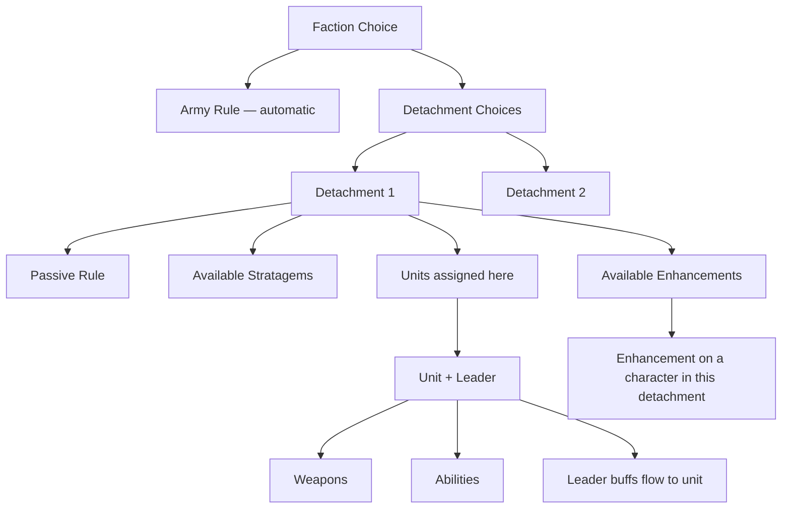

# Brain Design Review — The Full Picture

> What the game model is, how our data represents it, where it's right, where it's wrong.

---

## Part 1: What a 40K Army Actually Is

A player builds an army by making a series of nested choices. Each choice constrains the next.

```
I play BLOOD ANGELS                          ← Pick a faction
  My army rule is Oath of Moment             ← Comes automatically
  
  I'm taking Wrath of the Doomed (2pts)      ← Pick detachment(s), spend points
    This gives me Fanatical Celerity         ← The detachment's passive rule
    I can use Rage-Fuelled Response          ← Its stratagems are available
    I put Instinctive Interception on        ← Its enhancements are available
      my Death Company Captain               ← Enhancement goes on a character
    
    Units in this detachment:
      Lemartes                               ← He qualifies (DEATH COMPANY keyword)
        leading Death Company Marines         ← Leader attachment (keyword match)
        his abilities buff the squad          ← Leader abilities flow to unit
      Death Company Marines with Jump Packs
      
  I'm also taking Gladius Task Force (1pt)    ← Second detachment (11th edition)
    Units in this detachment:
      Intercessors
      Redemptor Dreadnought
```

### The key insight: everything flows DOWN from choices



The army rule applies to EVERYTHING. A detachment's rules apply only to units IN that detachment. An enhancement applies to ONE character. A leader's abilities apply to the unit they're attached to.

---

## Part 2: The Objects and What They Mean

### Faction
**What it is in the game:** Your army identity. Determines your army rule, which detachments you can take, and which units you have access to.

**What it is in our data:** A root node (`category: "faction"`) auto-generated from unique factionId values. Connected to army rules and detachments via `part_of`.

**What's wrong:** 
- SM chapters (Blood Angels, Dark Angels) exist as BOTH a separate `factionId` (from Wahapedia) AND a subfaction of `space-marines` (from faction packs). We've partially unified this but it's inconsistent.
- **CORRECTED (2026-05-07):** There is no "accesses" relationship between factions. Generic SM units/detachments without a subfaction keyword are available to ALL chapters. The availability is determined by the ABSENCE of a subfaction, not by a link between factions. A query is just: same factionId where subfaction matches mine OR subfaction is empty.
- Non-codex-compliant chapters (Blood Angels, Dark Angels, Space Wolves, Black Templars, Deathwatch) — also called "divergent chapters" — have their own supplement rules but share all generic SM content (units and detachments without subfaction keywords).

### Army Rule
**What it is in the game:** A passive ability that applies to your entire army at all times. Every faction has one. Oath of Moment, Waaagh!, Synapse, etc.

**What it is in our data:** Nodes with `category: "army-rule"` (reclassified from `faction-ability` during build). Connected to faction via `part_of`.

**What's wrong:**
- Some army rules have sub-rules (Blessings of Khorne has 6 options). These are separate nodes with parenthetical titles. The parent-child relationship uses ID prefix matching, not an explicit ref.
- Army rules aren't connected to the units they affect. Oath of Moment affects every SM unit, but there's no ref from the rule to units. The connection is implicit: same factionId.

### Detachment
**What it is in the game:** A package you buy with detachment points. Contains one passive rule, up to 6 stratagems, and several enhancements. In 10th edition, you pick one. In 11th, you pick multiple. Each detachment may only affect units with certain keywords (e.g., Wrath of the Doomed primarily affects DEATH COMPANY units).

**What it is in our data:** TWO nodes per detachment:
1. `category: "detachment"` — the container (auto-generated)
2. `category: "detachment-rule"` — the passive ability

Stratagems and enhancements connect to the container via `part_of`. Units connect via `eligible_for`.

**What's wrong:**
- The container is auto-generated from the detachment-rule, so it's a duplicate with the same title and content. It should be a distinct object with its own summary (e.g., "3 stratagems, 2 enhancements, costs 2 detachment points").
- Detachment point costs aren't stored (we know the system exists but don't have per-detachment costs yet).
- We don't know which KEYWORDS a detachment's rules care about. "Wrath of the Doomed" mainly buffs DEATH COMPANY units, but our `eligible_for` refs just check faction/subfaction, not keywords. Any Blood Angels unit shows as eligible, even though an Intercessor squad barely benefits from it.
- In 11th edition, a unit is assigned to ONE detachment. Our model says "eligible for" but doesn't capture the assignment — that's a list-building decision, not a data fact.

### Stratagem
**What it is in the game:** A one-shot ability you pay CP for. Comes from a detachment. Has a timing (when), a target restriction (what unit/type), and an effect. In 10th: limited to once per phase per stratagem (but you could stack different stratagems on the same unit). In 11th: a unit cannot have more than one stratagem applied to it per phase — one stratagem per unit per phase.

**What it is in our data:** Nodes with `category: "stratagem"`, connected to their detachment via `part_of`. Phase stored in the `phase` field. The target restriction is in the content text but NOT parsed as structured data.

**What's wrong:**
- Target restrictions aren't structured. "When a friendly DEATH COMPANY unit..." is just text. We can't programmatically answer "which stratagems can Lemartes use?" without parsing the text.
- No CP cost field on the node. It's in the content text.
- No distinction between core stratagems (available to everyone) and detachment stratagems.
- **10th edition:** stratagems only target units in their own detachment. **11th edition:** unknown — TBD when rules release.
- **11th edition change:** a unit cannot have more than one stratagem applied to it per phase (in 10th, different stratagems could stack on the same unit in the same phase).

### Enhancement
**What it is in the game:** A permanent upgrade given to a character model. Comes from a detachment. Has a model restriction (e.g., "PHOBOS model only") and an effect.

**What it is in our data:** Nodes with `category: "enhancement"`, connected to their detachment via `part_of`.

**What's wrong:**
- Model restriction isn't structured. "DEATH COMPANY model only" is just text. We can't programmatically filter which enhancements a specific character can take.
- Points cost isn't stored.

### Unit (Datasheet)
**What it is in the game:** A squad of models you put on the table. Has a stat line (M, T, SV, W, LD, OC), weapons, abilities, and keywords. Can have a character leader attached.

**What it is in our data:** Nodes with `category: "datasheet"`. Weapons and abilities connect via `part_of`. Keywords stored in the `keywords` array. Leader attachments stored as `interacts_with` refs.

**What's wrong:**
- Stat line isn't parsed into structured fields. It's in the content text. Can't do "show me all T5 units."
- Keywords are in the `keywords` array but mixed with search keywords. Game keywords (INFANTRY, DEATH COMPANY, FLY) are mixed with indexing keywords (the unit name, faction name).
- Leader attachment refs exist (`interacts_with` with context "This leader can be attached to...") but they're not typed distinctly. Can't filter for just leader attachments vs other interactions.
- **Leader abilities are NOT automatic.** Each ability explicitly states whether it affects the leader only or the whole attached unit. Abilities conditioned on "while leading a unit" only work when the leader has a bodyguard. In 10th, the leader LOSES those abilities when their bodyguard unit dies. In 11th, the leader KEEPS those abilities even after their unit is destroyed. This is a per-ability assessment, not a blanket rule.
- No concept of "this unit is primarily a melee unit" or "this is a transport" — role/type classification is missing.
- **Epic Heroes (named characters) cannot take enhancements.** This is a hard constraint not currently enforced in the data.

### Weapon
**What it is in the game:** A weapon profile with stats (Range, A, BS/WS, S, AP, D) and keywords (Sustained Hits, Lethal Hits, etc.).

**What it is in our data:** Nodes with `category: "weapon"`, connected to parent unit via `part_of`. Stats in content text. Weapon keywords in the keywords array.

**What's wrong:**
- Stats aren't structured fields. "Range 24\", A 2, BS 3+, S 4, AP -1, D 1" is text. Can't compute damage output without parsing.
- This is the data the versus simulator needs, and it currently parses it client-side from game-data-store, not from brain nodes.

### Core Mechanic
**What it is in the game:** A universal game rule like Sustained Hits, Lethal Hits, Deep Strike, Feel No Pain. Defined in the core rules, referenced by hundreds of abilities.

**What it is in our data:** Nodes with `category: "core-mechanic"`. Abilities connect to them via `modifies` or `interacts_with` refs.

**What's right:** This works well. Search "sustained hits" → get the core rule + everything that grants it.

### Community Content
**What it is:** Tactics, analysis, worked examples from YouTube videos and articles. Not official rules — player knowledge.

**What it is in our data:** Nodes with `layer: "community"`, `category: "tactic"/"ruling"/"worked-example"`. Found by Vectorize semantic search. No structural refs to game objects.

**What's wrong:**
- Completely disconnected from the hierarchy. A video about "Blood Angels in Wrath of the Doomed" doesn't connect to either the faction node or the detachment node. It's only findable by text similarity.
- 7,694 community nodes — the largest category — floating without structure.

---

## Part 3: How Users Navigate This

### User Story 1: "I play Blood Angels, what are my options?"

**What should happen:**
1. See Blood Angels as a faction with its army rule
2. See all available detachments with summaries of what they do
3. For each detachment, see what it's good at and which units benefit most
4. See the BA-specific units
5. See the generic SM units they also have access to

**What actually happens:**
1. ✅ Faction node shows with army rule and detachments
2. ✅ Detachments show as connections
3. ❌ No indication of which units benefit from which detachment — eligible_for is too broad (all BA units eligible for all BA detachments)
4. ❌ Units don't appear on the faction view (two hops away)
5. ❌ Generic SM access not represented at all

### User Story 2: "What can Lemartes do?"

**What should happen:**
1. See Lemartes' stat line, weapons, abilities
2. See which detachments make him strongest
3. See which units he can lead
4. See which stratagems/enhancements work with him
5. See competitive combos

**What actually happens:**
1. ✅ Weapons and abilities show via part_of
2. ⚠️ Eligible detachments show, but ALL of them — no ranking by relevance
3. ❌ Leader attachments exist as interacts_with refs but aren't surfaced distinctly
4. ❌ Stratagems that TARGET him aren't connected (target restriction is unstructured text)
5. ⚠️ stacks_with combos exist but aren't scoped to "combos involving Lemartes' abilities specifically"

### User Story 3: "How do sustained hits work with space marines?"

**What should happen:**
1. See the core Sustained Hits rule
2. See every SM ability/stratagem/detachment that grants Sustained Hits
3. See which units have it natively on weapons
4. See combos (sustained hits + hit re-rolls = fishing)

**What actually happens:**
1. ✅ Core rule found via Vectorize
2. ✅ Connected nodes found via reverse index, filtered by faction
3. ⚠️ Weapons with native Sustained Hits show but mixed with everything else
4. ✅ stacks_with combos exist and show

---

## Part 4: The Structural Problems

### Problem 1: Keyword eligibility is invisible
Detachments don't just apply to "all faction units." They apply to units with specific keywords. Wrath of the Doomed cares about DEATH COMPANY. Ironstorm Spearhead cares about VEHICLE. Our `eligible_for` refs ignore this — every SM unit is "eligible" for every SM detachment, which is technically true but useless for recommendations.

### Problem 2: Leader attachments aren't first-class
Which character can lead which unit is critical information. "Lemartes can lead Death Company Marines" matters. The data exists as `interacts_with` refs but they're not typed specifically, not surfaced in the UI, and not used in the graph navigation.

### Problem 3: Target restrictions are unstructured
Stratagems and enhancements have target restrictions ("DEATH COMPANY model only", "VEHICLE unit") buried in text. We can't answer "which stratagems can I use on Lemartes?" without NLP on every stratagem's text.

### Problem 4: The shared SM content model is a hack
Blood Angels = `factionId: "blood-angels"` content + `factionId: "space-marines", subfaction: "blood angels"` content + generic `factionId: "space-marines"` content with no subfaction. Three different ways to represent "belongs to Blood Angels." The faction filter has to check all three, and it still doesn't handle "generic SM content is available to all chapters."

### Problem 5: No scoring/ranking on connections
When Lemartes shows 20 eligible detachments, they're all equal. There's no "this detachment is GREAT for Lemartes because it buffs DEATH COMPANY" vs "this detachment is irrelevant because it buffs VEHICLE units." The keyword affinity between units and detachments isn't computed.

### Problem 6: Container nodes duplicate their content
Every detachment has a container node AND a rule node with the same title and content. The container was supposed to be a distinct object ("Wrath of the Doomed: 3 stratagems, 2 enhancements") but it's just a copy of the rule.

---

## Part 5: What Needs to Change

These are the structural issues. Not code fixes — data model changes.

1. **Structured fields on stratagems/enhancements**: CP cost, phase, target keyword restriction as parsed fields, not buried in text.

2. **Keyword-based detachment affinity**: For each detachment, extract which keywords its rules care about. Score units by how many of those keywords they have. "Wrath of the Doomed + Lemartes = high affinity (DEATH COMPANY keyword match)" vs "Ironstorm Spearhead + Lemartes = low affinity (not a VEHICLE)."

3. **Leader attachment as a distinct ref type**: Replace generic `interacts_with` with `can_lead` refs. Surface them explicitly in the UI.

4. **Faction access model**: Define which factions can access which other factions' content. Blood Angels → generic Space Marines. This isn't inheritance — it's an access list.

5. **Container nodes with real content**: Detachment containers should summarize what's inside them (count of stratagems, enhancements, key keywords, affinity scores) rather than duplicating the rule text.

6. **Structured stat lines**: Parse weapon and unit stats into fields so the versus simulator and the brain can share computation.
