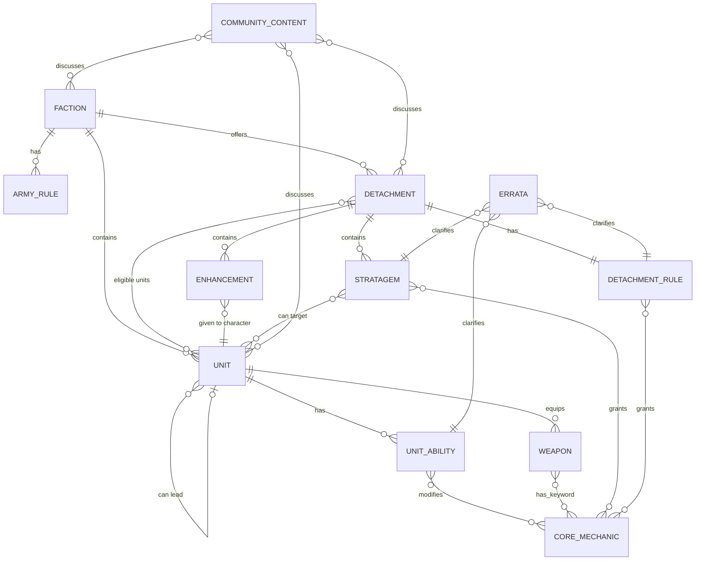

# Brain Domain Model

---

## Entity-Relationship Diagram



---

## Entity Definitions with Real Data

### FACTION

```yaml
id: faction-root:blood-angels
type: faction
fields:
  name: "BLOOD ANGELS"
  army_rule: "Oath of Moment"          # ref to army-rule node
  parent_faction: "space-marines"       # accesses generic SM content
  edition: "10th"
  
relationships:
  has_army_rules:
    - "Oath of Moment"                  # inherited from space-marines
    - "The Sons of Sanguinius"          # BA-specific
  offers_detachments:
    - "Wrath of the Doomed"             # BA-specific
    - "Angelic Host"                    # BA-specific
    - "Gladius Task Force"              # from parent space-marines
    - "Ironstorm Spearhead"            # from parent space-marines
  contains_units:
    - "Lemartes"                        # BA-specific (BLOOD ANGELS keyword)
    - "Death Company Marines"           # BA-specific
    - "Intercessors"                    # from parent space-marines (no subfaction lock)
    - "Redemptor Dreadnought"          # from parent space-marines
```

**What we have now:** Faction node exists. `offers_detachments` represented by `part_of` refs. `contains_units` NOT represented (no ref from units to factions). **CORRECTED (2026-05-07):** No `parent_faction` or "accesses" relationship needed. Generic SM content (units and detachments without a subfaction keyword) is available to all chapters. The query is: same factionId where subfaction matches mine OR subfaction is empty.

---

### DETACHMENT

```yaml
id: detachment:wrath-of-the-doomed
type: detachment
fields:
  name: "Wrath of the Doomed"
  faction: "blood-angels"
  edition: "11th"
  detachment_points: 2                  # 11th edition cost
  primary_keywords: ["DEATH COMPANY"]   # units with these keywords benefit most
  restriction: "BLOOD ANGELS only"
  
relationships:
  has_rule:
    - "Fanatical Celerity"              # the passive ability
  contains_stratagems:
    - "Rage-Fuelled Response" (1CP, opponent's shooting phase)
    - "Heroic Intervention" (1CP, opponent's charge phase)
  contains_enhancements:
    - "Instinctive Interception" (DEATH COMPANY model only)
  eligible_units:                       # units that CAN be in this detachment
    - "Lemartes"                        # ✅ BLOOD ANGELS + DEATH COMPANY
    - "Death Company Marines"           # ✅ BLOOD ANGELS + DEATH COMPANY
    - "Death Company Marines w/ Jump Packs" # ✅
    - "Intercessors"                    # ⚠️ eligible but LOW affinity (not DEATH COMPANY)
    - "Redemptor Dreadnought"          # ⚠️ eligible but LOW affinity
  high_affinity_units:                  # units that SHOULD be in this detachment
    - "Lemartes"                        # DEATH COMPANY keyword match
    - "Death Company Marines"           # DEATH COMPANY keyword match
    - "Death Company Captain"           # DEATH COMPANY keyword match
```

**What we have now:** Detachment container node exists. `has_rule` via `part_of`. `contains_stratagems/enhancements` via `part_of`. `eligible_units` via `eligible_for` refs — but NO keyword affinity. All BA units show as equally eligible. `detachment_points` and `primary_keywords` NOT stored. `high_affinity_units` NOT computed.

---

### UNIT (Datasheet)

```yaml
id: 000000164                           # Wahapedia datasheet ID
type: datasheet
fields:
  name: "Lemartes"
  faction: "space-marines"
  subfaction: "blood angels"
  edition: "10th"
  points: 80
  stats:
    M: 12"    T: 4    SV: 3+    W: 4    LD: 5+    OC: 1
  keywords:
    game: ["INFANTRY", "CHARACTER", "EPIC HERO", "FLY", "JUMP PACK", 
           "DEATH COMPANY", "CHAPLAIN", "BLOOD ANGELS", "ADEPTUS ASTARTES", "IMPERIUM"]
    role: ["melee", "leader", "buff"]   # derived, not in source data
    
relationships:
  equips_weapons:
    - "The Blood Crozius" (melee, S6, AP-1, D2)
    - "Bolt Pistol" (ranged, S4, AP0, D1)
  has_abilities:
    - "Black Rage" (hit re-rolls when below half strength)
    - "Guardian of the Lost" (leader ability: unit gets FNP 6+)
  can_lead:                             # leader attachment
    - "Death Company Marines"
    - "Death Company Marines with Jump Packs"
  eligible_for_detachments:
    - "Wrath of the Doomed"             # HIGH affinity (DEATH COMPANY keyword)
    - "Angelic Host"                    # MEDIUM affinity (BLOOD ANGELS)
    - "Gladius Task Force"              # LOW affinity (generic SM)
    - "Ironstorm Spearhead"            # LOW affinity (not VEHICLE)
  can_receive_enhancements: []          # EPIC HERO — cannot take enhancements
  targeted_by_stratagems:
    - "Rage-Fuelled Response" (targets DEATH COMPANY units)
    - "Angel's Sacrifice" (targets BLOOD ANGELS CHARACTER)
    - "Armour of Contempt" (targets any ADEPTUS ASTARTES)
```

**What we have now:** Datasheet node exists. `equips_weapons` via `part_of`. `has_abilities` via `part_of`. `can_lead` exists as `interacts_with` refs but NOT typed distinctly. `eligible_for_detachments` via `eligible_for` but NO affinity scoring. `stats` NOT structured — buried in content text. `keywords.game` stored but mixed with search index keywords. `targeted_by_stratagems` NOT represented — would require parsing stratagem target text. `can_receive_enhancements` NOT represented.

---

### STRATAGEM

```yaml
id: det:space-marines:wrath-of-the-doomed:rage-fuelled-response
type: stratagem
fields:
  name: "Rage-Fuelled Response"
  detachment: "Wrath of the Doomed"
  faction: "blood-angels"
  edition: "10th"
  cp_cost: 1
  phase: "opponent's shooting"
  target_restriction:
    keyword: "DEATH COMPANY"
    condition: "unengaged, after being shot"
  effect: "Unit can make a surge move of up to D6\""
  
relationships:
  belongs_to: "Wrath of the Doomed"     # detachment
  can_target:                           # derived from target_restriction
    - "Lemartes"                        # has DEATH COMPANY keyword
    - "Death Company Marines"
    - "Death Company Captain"
  modifies_mechanic:
    - "Movement" (grants out-of-sequence move)
```

**What we have now:** Stratagem node exists. `belongs_to` via `part_of`. `phase` stored. `cp_cost` NOT a field — buried in title/content text. `target_restriction` NOT structured — buried in content. `can_target` NOT computed. `modifies_mechanic` partially represented via `modifies`/`interacts_with` refs.

---

### WEAPON

```yaml
id: weapon:000000164:the-blood-crozius
type: weapon
fields:
  name: "The Blood Crozius"
  unit: "Lemartes"
  type: "melee"
  stats:
    A: 5    WS: 2+    S: 6    AP: -1    D: 2
  keywords: ["DEVASTATING WOUNDS"]
  
relationships:
  equipped_by: "Lemartes"               # part_of
  has_keyword: "Devastating Wounds"     # links to core mechanic
```

**What we have now:** Weapon node exists. `equipped_by` via `part_of`. Stats NOT structured — in content text. Weapon keywords mixed with search keywords.

---

### ENHANCEMENT

```yaml
id: det:space-marines:wrath-of-the-doomed:instinctive-interception
type: enhancement
fields:
  name: "Instinctive Interception"
  detachment: "Wrath of the Doomed"
  faction: "blood-angels"
  edition: "10th"
  model_restriction:
    keyword: "DEATH COMPANY"
    type: "model"                       # goes on a model, not a unit
  effect: "Heroic Intervention stratagem costs -1 CP for this unit"
  
relationships:
  belongs_to: "Wrath of the Doomed"     # detachment
  can_be_given_to:                      # derived from model_restriction
    - "Death Company Captain"           # DEATH COMPANY CHARACTER
    - "Lemartes"                        # wait — EPIC HERO, can't take enhancements
  modifies_mechanic:
    - "Heroic Intervention" (reduces CP cost)
```

**What we have now:** Enhancement node exists. `belongs_to` via `part_of`. `model_restriction` NOT structured. `can_be_given_to` NOT computed.

---

### CORE_MECHANIC

```yaml
id: core:sustained-hits
type: core-mechanic
fields:
  name: "Sustained Hits"
  rule_text: "Each time an attack scores a Critical Hit, score additional hits..."
  edition: "10th"
  
relationships:
  granted_by:                           # reverse of modifies
    - "Storm of Fire" (detachment rule, SM)
    - "Bolter Discipline" (unit ability, SM)
    - "Dakka! Dakka! Dakka!" (detachment rule, Orks)
    - 35+ stratagems across factions
  native_on_weapons:
    - "Twin supa-shoota" (Orks)
    - "Snazzgun" (Orks)
    - 245+ weapons
  combos_with:                          # stacks_with
    - "Hit re-rolls" (fishing for extra hits)
```

**What we have now:** Core mechanic node exists. `granted_by` via `modifies` refs in reverse index. `native_on_weapons` via weapon keywords referencing the mechanic. `combos_with` via `stacks_with`. This is the best-connected part of the model.

---

### LEADER ATTACHMENT

Not a node — it's a relationship between two units.

```yaml
relationship: can_lead
source: "Lemartes"
target: "Death Company Marines"
condition: "DEATH COMPANY INFANTRY keyword match"
effect: "Lemartes joins the unit. His leader abilities apply to all models."

leader_abilities_that_flow:
  - "Guardian of the Lost" → unit gets FNP 6+
  - "Black Rage" → already on Death Company, but Lemartes' version may differ
```

**What we have now:** `interacts_with` ref exists between leader and unit with context text "This leader can be attached to this unit as a Bodyguard." But:
- Not a distinct ref type (mixed in with other `interacts_with` refs)
- Leader abilities aren't explicitly linked to the units they'd flow to
- The graph doesn't surface "who can Lemartes lead?" as a navigation path

---

## Gap Summary

| What | Have | Need |
|---|---|---|
| Faction → army rules | ✅ part_of | ✅ |
| Faction → detachments | ✅ part_of | ✅ |
| Faction → units | ❌ | part_of or similar |
| Faction → shared faction access | ❌ | accesses ref |
| Detachment → rule/strats/enhancements | ✅ part_of | ✅ |
| Detachment → eligible units | ✅ eligible_for | Need affinity scoring |
| Detachment keyword affinity | ❌ | primary_keywords field |
| Detachment points cost | ❌ | Field on node |
| Unit → weapons/abilities | ✅ part_of | ✅ |
| Unit → eligible detachments | ✅ eligible_for | Need affinity scoring |
| Unit → can lead | ⚠️ interacts_with | Distinct can_lead ref type |
| Unit stat line | ❌ unstructured | Parsed fields |
| Unit game keywords vs search keywords | ❌ mixed | Separate arrays |
| Stratagem CP cost | ❌ in text | Parsed field |
| Stratagem target restriction | ❌ in text | Parsed keyword field |
| Stratagem → targetable units | ❌ | Computed from keyword match |
| Enhancement model restriction | ❌ in text | Parsed keyword field |
| Enhancement → eligible characters | ❌ | Computed from keyword match |
| Ability → core mechanic | ✅ modifies | ✅ |
| Combo detection | ✅ stacks_with | ✅ (needs affinity context) |
| Community → game objects | ❌ | Structural refs |
| Errata → corrected rules | ✅ clarifies | ✅ |
