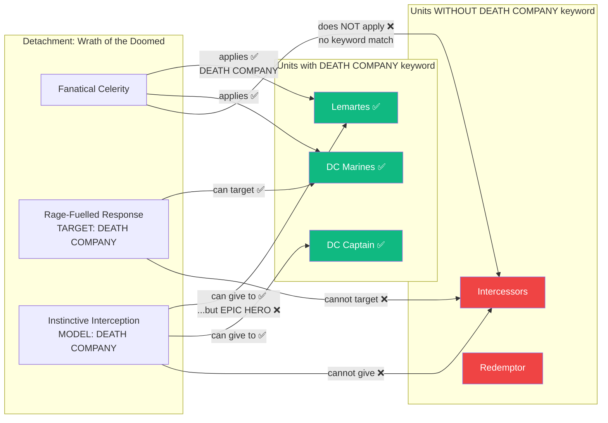
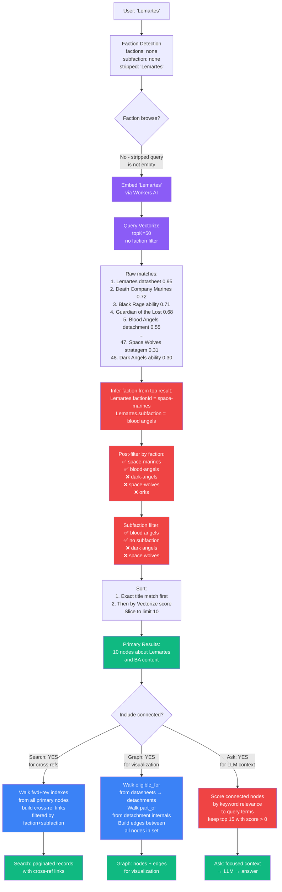
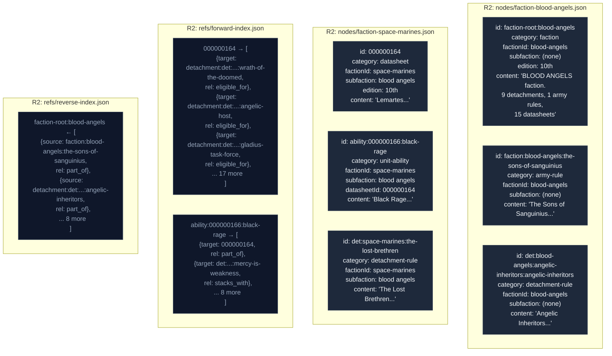
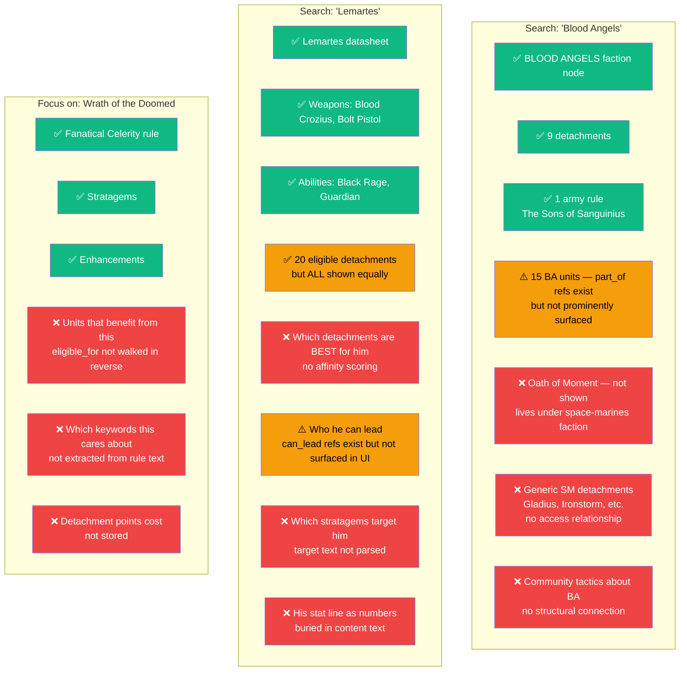

# Brain Full Model — Multi-Layer Diagrams

---

## Diagram 1: A Complete Army — All Layers Visible

This shows a real Blood Angels army with every object type, every relationship, and every constraint in one view. The colors indicate what layer each thing lives on.

**Assumption: A Blood Angels player has access to BA-specific content AND generic Space Marines content. Is this correct?**

```mermaid
graph TD
    classDef faction fill:#3b82f6,color:white
    classDef armyrule fill:#8b5cf6,color:white
    classDef detachment fill:#f59e0b,color:black
    classDef detrule fill:#fbbf24,color:black
    classDef stratagem fill:#ef4444,color:white
    classDef enhancement fill:#10b981,color:white
    classDef unit fill:#06b6d4,color:white
    classDef weapon fill:#64748b,color:white
    classDef ability fill:#ec4899,color:white
    classDef core fill:#f97316,color:white

    %% FACTION LAYER
    BA[BLOOD ANGELS]:::faction
    SM[SPACE MARINES\ngeneric - shared]:::faction
    %% No "accesses" ref — generic SM content (no subfaction) is available to all chapters

    %% ARMY RULES — always active
    OOM[Oath of Moment\nre-roll hits+wounds vs 1 target\nAPPLIES TO: all units in army]:::armyrule
    SOS[The Sons of Sanguinius\nBA-specific army rule]:::armyrule
    OOM -->|part_of| SM
    SOS -->|part_of| BA

    %% DETACHMENTS — player picks these
    WOD[Wrath of the Doomed\n2pts - DEATH COMPANY focused]:::detachment
    AH[Angelic Host\n1pt - CHARACTER focused]:::detachment
    GLAD[Gladius Task Force\n3pts - all-rounder]:::detachment
    WOD -->|part_of| BA
    AH -->|part_of| BA
    GLAD -->|part_of| SM

    %% DETACHMENT INTERNALS — what each detachment contains
    FC[Fanatical Celerity\nadvance+charge for\nDEATH COMPANY at cost of MW]:::detrule
    RFR[Rage-Fuelled Response\n1CP - surge D6 after being shot\nTARGET: DEATH COMPANY]:::stratagem
    II[Instinctive Interception\nHeroic Intervention -1CP\nMODEL: DEATH COMPANY only]:::enhancement
    
    FC -->|rule_of| WOD
    RFR -->|part_of| WOD
    II -->|part_of| WOD

    AH_RULE[Angelic Host Rule\nbuffs CHARACTER units]:::detrule
    AH_STRAT[Angel's Sacrifice\n1CP\nTARGET: BA CHARACTER]:::stratagem
    AH_RULE -->|rule_of| AH
    AH_STRAT -->|part_of| AH

    GLAD_RULE[Combat Doctrines\ncycle each turn\nAPPLIES TO: all ADEPTUS ASTARTES]:::detrule
    GLAD_STRAT[Armour of Contempt\n1CP\nTARGET: any ADEPTUS ASTARTES]:::stratagem
    GLAD_RULE -->|rule_of| GLAD
    GLAD_STRAT -->|part_of| GLAD

    %% UNITS — assigned to detachments
    LEM[Lemartes\nM12 T4 SV3+ W4\nKEYWORDS: DEATH COMPANY,\nCHARACTER, CHAPLAIN, FLY,\nEPIC HERO]:::unit
    DCM[Death Company Marines\nM6 T4 SV3+ W2 x5\nKEYWORDS: DEATH COMPANY,\nINFANTRY]:::unit
    INT[Intercessors\nM6 T4 SV3+ W2 x5\nKEYWORDS: INFANTRY,\nBATTLELINE]:::unit
    RED[Redemptor Dreadnought\nM8 T10 SV2+ W12\nKEYWORDS: VEHICLE,\nWALKER]:::unit

    LEM -->|assigned_to| WOD
    DCM -->|assigned_to| WOD
    INT -->|assigned_to| GLAD
    RED -->|assigned_to| GLAD

    %% LEADER ATTACHMENT — character joins unit
    LEM ==>|leads| DCM
    
    %% LEADER ABILITIES FLOW DOWN
    GOTL[Guardian of the Lost\nunit gets FNP 6+]:::ability
    GOTL -->|part_of| LEM
    GOTL -.->|flows to| DCM

    %% UNIT WEAPONS + ABILITIES
    BC[The Blood Crozius\nS6 AP-1 D2\nDEVASTATING WOUNDS]:::weapon
    BR[Black Rage\nhit re-rolls below\nhalf strength]:::ability
    BC -->|part_of| LEM
    BR -->|part_of| LEM

    ABR[Auto Bolt Rifle\nS4 AP0 D1\nASSAULT]:::weapon
    ABR -->|part_of| INT

    %% WHAT APPLIES TO WHAT
    %% Army rules → all units
    OOM -.->|applies to| LEM
    OOM -.->|applies to| DCM
    OOM -.->|applies to| INT
    OOM -.->|applies to| RED

    %% Detachment rules → units in that detachment with matching keywords
    FC -.->|applies to\nDEATH COMPANY keyword| LEM
    FC -.->|applies to\nDEATH COMPANY keyword| DCM
    GLAD_RULE -.->|applies to\nADEPTUS ASTARTES keyword| INT
    GLAD_RULE -.->|applies to\nADEPTUS ASTARTES keyword| RED

    %% Stratagems → targetable units
    RFR -.->|can target\nDEATH COMPANY + unengaged| LEM
    RFR -.->|can target\nDEATH COMPANY + unengaged| DCM
    GLAD_STRAT -.->|can target\nADEPTUS ASTARTES| INT
    GLAD_STRAT -.->|can target\nADEPTUS ASTARTES| RED

    %% Enhancement → one character
    II -.->|given to\nbut EPIC HERO cannot take| LEM

    %% CORE MECHANIC connections
    DW_CORE[Core: Devastating Wounds\nauto-wound on crit]:::core
    BC -.->|has keyword| DW_CORE

    %% COMBO
    BR <-.->|stacks_with\nhit re-rolls + dev wounds\n= fish for mortals| DW_CORE
```

**Assumptions — VERIFIED with Micah (2026-05-07):**
1. ✅ Army rules apply to ALL units regardless of detachment assignment.
2. ✅ Detachment rules apply only to units assigned to that detachment. BUT some detachments have keyword requirements (e.g., "only DEATH COMPANY units benefit") or apply new keywords to specified units (e.g., "your INFANTRY units gain BATTLELINE").
3. ✅ In an army list with multiple detachments, each unit is assigned to exactly one. But a unit CAN be in any detachment that doesn't restrict membership — eligibility is determined by the detachment's restrictions, not the unit's choice.
4. ✅ In 10th: stratagems can only target units in their own detachment. In 11th: unknown — flag for confirmation when rules drop.
5. ⚠️ NOT automatic. Each leader ability explicitly states whether it affects just the leader or the whole attached unit. Abilities that say "while leading a unit" only work when the leader has a bodyguard unit. In 10th, the leader LOSES those abilities when their unit dies. In 11th, the leader KEEPS those abilities even after their unit is destroyed.
6. ✅ Epic Heroes (named characters) cannot take enhancements. Hard constraint.
7. ✅ CORRECTED: There is NO "accesses" relationship between factions. Generic SM units (those without a subfaction keyword) are available to ALL chapters. When a unit has no subfaction, it's shared content — Intercessors, Redemptors, etc. belong to everyone. Same for detachments without a chapter restriction. The availability is determined by the ABSENCE of a subfaction, not by a link between factions.

---

## Diagram 2: Eligibility and Targeting — What Can Combine With What

This shows the constraint system. Green = legal, red = illegal.

**Assumption: The keyword system determines most eligibility. Is that the whole picture?**

**But wait — can those non-DEATH COMPANY units still be IN the Wrath of the Doomed detachment?**
- In 10th: Only 1 detachment, so all units are technically "in" it. But the rules only affect matching keywords.
- In 11th: Units are assigned to specific detachments. An Intercessor could be in WotD but wouldn't benefit from most of its rules.

**This is a critical question: Is eligibility about "can be assigned" or "benefits from"?**

---

## Diagram 3: How a Query Traverses the Data

Shows the actual path through the graph when a user searches for something, at every level.

**What this reveals:**
- Vectorize doesn't know about our ref structure. It finds semantically similar content. Refs are only used AFTER Vectorize narrows the candidates.
- Faction detection from the query is unreliable for unit names. "Lemartes" doesn't trigger faction detection — we infer from the result. "Blood Angels Lemartes" would detect the faction.
- Each endpoint uses the connected nodes differently. Search builds cross-ref links. Graph builds visual edges. Ask filters by keyword relevance. Same underlying retrieve(), different post-processing.

---

## Diagram 4: The Data At Rest — What's Actually Stored

Shows the actual node and ref structure as it exists in R2, not the conceptual model.

**What this reveals:**
- Blood Angels data lives in TWO files: `faction-blood-angels.json` (factionId: blood-angels) and `faction-space-marines.json` (factionId: space-marines, subfaction: blood angels). This split is the source of every faction-matching bug we've hit.
- Node IDs are inconsistent: Wahapedia uses numeric IDs (`000000164`), faction packs use slug-based IDs (`det:blood-angels:angelic-inheritors:angelic-inheritors`), 11th edition uses prefixed IDs (`11e:det:space-marines:wrath-of-the-doomed`), auto-generated containers use `detachment:` prefix.
- The ref indexes are keyed by node ID. A query for "what points to Blood Angels faction?" requires the reverse index. A query for "what is Lemartes eligible for?" requires the forward index. Both are ~10-14MB JSON files loaded once per Worker isolate.
- factionId inconsistency: Lemartes has `factionId: "space-marines"` but is functionally a Blood Angels unit. The Sons of Sanguinius has `factionId: "blood-angels"`. These represent the same army but use different identifiers.

---

## Diagram 5: What The User Sees vs What Exists

The navigation experience at each level, showing what appears and what's hidden.

---

## My Assumptions That May Be Wrong

I'm listing these explicitly so you can correct me:

1. **"Blood Angels accesses Space Marines content"** — RESOLVED: There is no "accesses" relationship. Generic SM content (no subfaction keyword) is available to all chapters. The query is: same factionId where subfaction matches mine OR subfaction is empty. Faction nodes are created by `buildFactionNodes()` in combo-detection.ts.

2. **"eligible_for means the unit can be in that detachment"** — I assumed any BA unit can be assigned to any BA detachment. But maybe some detachments REQUIRE specific keywords (not just benefit from them)?

3. **"One leader per unit"** — Is this always true? Can you stack two characters?

4. **"Stratagems target units in their own detachment"** — In 10th with one detachment this is moot. In 11th with multiple, can you use Detachment A's stratagem on a unit in Detachment B?

5. **"The faction node is the entry point"** — I assumed people navigate faction → detachment → unit. But maybe most users start from a unit ("I own Lemartes, what do I do with him?") and go up, not down.

6. **"Community content should connect to game objects"** — Maybe it's fine as a separate Vectorize-searchable pool. Maybe forcing structural refs onto opinion content is wrong.

7. **"Detachment containers and detachment rules are separate"** — Maybe they should be one node. The container was my invention to hold stratagems/enhancements. Maybe the detachment IS the rule + its contents, not a wrapper around them.
